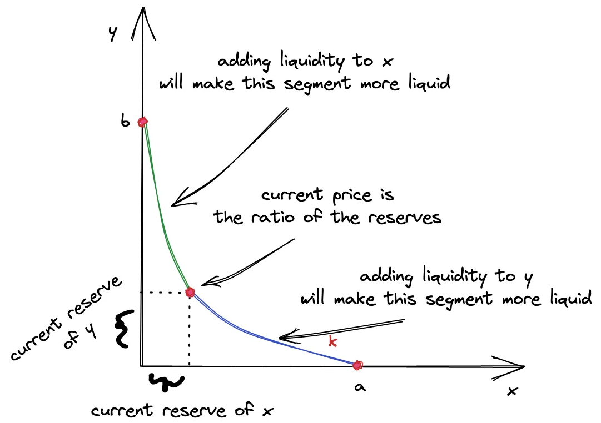

## Dex Swap (Uniswap V3) Architecture
```
       ┌────────────────────────────────────────────────────────┐
       │                     USER / WALLET                      │
       └───────────────────────────┬────────────────────────────┘
                                   │
                    Interacts via Periphery Contracts
                                   │
                                   ▼
┌────────────────────────────────────────────────────────────────────────┐
│                          PERIPHERY LAYER                               │
│                                                                        │
│   ┌──────────────────────────────┐    ┌────────────────────────────┐   │
│   │     NonfungiblePosition-     │    │        SwapRouter          │   │
│   │        Manager (NPM)         │    │  (Executes exact input/    │   │
│   │ (Mints & tracks LP ranges as │    │   output swaps across      │   │
│   │      ERC-721 NFT tokens)     │    │     multiple pools)        │   │
│   └──────────────┬───────────────┘    └─────────────┬──────────────┘   │
└──────────────────┼──────────────────────────────────┼──────────────────┘
                   │                                  │
                   │  Calls Mint/Burn/Swap            │
                   ▼                                  ▼
┌────────────────────────────────────────────────────────────────────────┐
│                            CORE LAYER                                  │
│                                                                        │
│   ┌────────────────────────────────────────────────────────────────┐   │
│   │                       UniswapV3Pool                            │   │
│   │                                                                │   │
│   │  ┌───────────────────────┐            ┌─────────────────────┐  │   │
│   │  │     Asset Ledger      │            │   Boundary Tracker  │  │   │
│   │  │ • Holds actual tokens │            │ • Maps active price │  │   │
│   │  │   for the pair        │            │   liquidity ranges  │  │   │
│   │  └───────────────────────┘            └─────────────────────┘  │   │
│   │                                                                │   │
│   │  ┌───────────────────────┐            ┌─────────────────────┐  │   │
│   │  │   Price Data Vault    │            │     Fee Splitter    │  │   │
│   │  │ • Stores historical   │            │ • Accounts for and  │  │   │
│   │  │   price records       │            │   allocates trader  │  │   │
│   │  └───────────────────────┘            │   fees to LPs       │  │   │
│   │                                       └─────────────────────┘  │   │
│   └───────────────────────────────▲────────────────────────────────┘   │
└───────────────────────────────────┼────────────────────────────────────┘
                                    │
                         Deploys Pool Contracts
                                    │
┌───────────────────────────────────┴────────────────────────────────────┐
│                          FACTORY & ORACLES                             │
│                                                                        │
│   ┌──────────────────────────────┐    ┌────────────────────────────┐   │
│   │      UniswapV3Factory        │    │    Third-Party Apps        │   │
│   │                              │    │                            │   │
│   │ • Deploys new pools          │    │ • Reads price histories    │   │
│   │ • Acts as main registry      │    │ • Integrates pool data     │   │
│   │ • Sets official fee tiers    │    │   into external protocols  │   │
│   └──────────────────────────────┘    └────────────────────────────┘   │
└────────────────────────────────────────────────────────────────────────┘

```

## Core structure
```
core/
 ├── UniswapV3Pool.sol
 ├── UniswapV3Factory.sol
 ├── libraries/
 │    ├── Tick.sol
 │    ├── TickMath.sol
 │    ├── SwapMath.sol
 │    ├── SqrtPriceMath.sol
 │    ├── LiquidityMath.sol
 │    └── Oracle.sol
 │
periphery/
 ├── SwapRouter.sol
 ├── NonfungiblePositionManager.sol
 ├── Quoter.sol
 └── libraries/
```

## Important Concepts
### `Tick`
The smallest possible upward or downward price movement of a traded asset.

  - How price is represent in Uniswap V3: `price = token1/token0`
    ```
    真实价格
    ↓
    price = token1/token0
    ↓
    换算成 tick
    ↓
    再转成 sqrtPriceX96 = sqrt(1.0001^tick) * 2^96
    ```
  - Example: ETH/USDT = 1/3000
    | tick     | price    |
    |----------|----------|
    | 0        | 1        |
    | 1        | 1.0001   |
    | 2        | 1.0002   |
    | ...      | ...      |
    | -80067   | 1/3000   |

    

### `TickSpacing`
The minimum interval between valid ticks. Basically means “you can only place liquidity on certain tick intervals,” like only every 60 ticks, instead of every single tick, which keeps the pool cheaper and more efficient to manage. V3 规定只有被 tickSpacing 整除的 tick 才允许被初始化. tickSpacing 越大，每个 tick 流动性越多，tick 之间滑点越大，但会节省跨 tick 操作的 gas。

- Fee tiers and tickSpacing
    | tick     | tickSpacing |
    |----------|-------------|
    | 0.01%    | 1           |
    | 0.05%    | 10          |
    | 0.3%     | 60          |
    | 1%       | 200         |

### `crossing tick`
价格穿过一个流动性边界。V3 中LP 不是全区间提供流动性。而是：

```
[tickLower, tickUpper]
```

例如：

```
Alice:
[100, 200]
```

Alice 的 liquidity只在 tick 100 ~ 200 有效, 价格移动时会发生什么?

假设当前价格：

```
tick = 150
```

Alice liquidity 生效。现在有人大量买 ETH, 价格上涨:

```
150 -> 160 -> 170 -> ... -> 200 -> 201
```

当：

```
200 -> 201
```

这一瞬间crossing tick 200, 因为tick 200 是：

```
Alice liquidity range 的边界
```

价格越过后Alice liquidity不再有效,于是 V3 必须：

```
activeLiquidity -= AliceLiquidity
```

这就是crossing tick

### `Liquidity`
How much trading capacity an LP provides within a specific price range.
- In Uniswap v2, liquidity is spread across all prices, most capital sits unused.
- In Uniswap v3 idea: Concentracted liquidity. LPs choose a price range, example:
   - ETH price now = `$3000`, LP may provide liquidity only between: `$2500 and $3500`.
   - That means **deeper liquidity** near current price, **less slippage** and **higher fee efficiency**

What does liquidity means mathmatically?
- Let's say the LP provides liquidity beteen [p_a, p_b]. Value x is reserve of token0 and y is reserve of token1.
- `x * y = k and p = y / x`
- `L = sqrt(k)`
So `x = L / sqrt(p), y = L * sqrt(p)`

- When moving the current price p to p_b, token0 will be eventually used. That means `delta_x = L_0 / sqrt(p) - L_0 / sqrt(p_b)`. So **`L_0 = delta_x * sqrt(p) * sqrt(p_b) / (sqrt(p_b) - sqrt(p))`**
- When moving the current pice p to p_a, token1 will be used up. Thus `delta_y = L_1 * sqrt(p) - L_1 * sqrt(p_a)`. So **`L_1 = delta_y / (sqrt(p) - sqrt(p_a))`**
- The liquidity **`L = min(L_0, L_1)`**

### `LP Position`
```
Alice:
ETH/USDC
tickLower = 200000
tickUpper = 210000
liquidity = 1000
```
### `Swap direction`
Inside V3 pools:
- price = token1 / token0
- token0 is the token with smaller address
- token1 is the token with larger address

Swap direction is determined by `is tokenIn the smaller-address token?` 
- If yes, tokenIn is token0, so swap token0 -> token1. 
- Otherwise tokenIn is token1, swap token1 -> token0.

## `Create Liquidity`
```
LP
 │
 │ mint()
 ▼
PositionManager
 │
 │ addLiquidity() - calculate liquidity L = min(L0, L1)
 ▼
PositionManager
 │
 │ pool.mint()
 ▼
Pool
 │
 │ "pay me tokens"
 │ callback
 ▼
PositionManager.uniswapV3MintCallback()
 │
 │ transferFrom(LP → Pool)
 ▼
ERC20 token contract
 │
 ▼
Pool receives tokens
 │
 ▼
liquidity activated
 │
 │ ERC721._mint()
 ▼
PositionManager
 │
 ▼
NFT → LP
```
- The NFT only represents ownership of a position record
```
ERC721 NFT
(tokenId = 42)
     │
     │ ownership only
     ▼

_positions[42]
{
    liquidity: 100,
    tickLower: ...,
    tickUpper: ...,
    ...
}
```
## `Increase Liquidity`
```
increaseLiquidity()
    │
    ├── add liquidity to pool
    │
    ├── read latest fee accumulators (fee growth per liquidity unit)
    │
    ├── compute pending fees earned so far
    │
    ├── store owed/claimable fees
    │
    ├── update fee checkpoint
    │
    └── increase liquidity amount
```
- Pool does NOT track: Alice earned X fees. Instead it tracks: `fee growth per liquidity unit`. This is classic accumulator accounting.

## `Decrease Liquidity`
```
decreaseLiquidity()
    ↓
tokensOwed updated (withdrawn principal and accumulated fees)
tokens now claimable (BUT NOT TRANSFERRED)
    
Later:

  user 
    ↓
collect()
    ↓
actual ERC20 transfer
```

## `_modifyPosition`
- Almost everything:
  - mint
  - burn
  - increaseLiquidity
  - decreaseLiquidity
- Eventually funnels into: `_modifyPosition()`. Given a liquidity range and liquidity delta, how many token0/token1 are needed?
  ```
  _modifyPosition()
    │
    ├── validate ticks
    ├── update fee/tick accounting
    ├── determine current price region
    ├── compute token deltas
    └── update active liquidity

  amount0 = getAmount0Delta(
    currentPrice,
    upperPrice,
    liquidityDelta
  )

  amount1 = getAmount1Delta(
    lowerPrice,
    currentPrice,
    liquidityDelta
  )
  ```
- At lower bound: `position is all token0`
- At upper bound: `position is all token1`
- Between the range: `position is active, both token0 and token1 are needed`

## Swap
- `SwapRouter` contains following swap methods:
  - `exactInput`：多池交换，用户指定输入代币数量，尽可能多地获得输出代币；
  - `exactInputSingle`：单池交换，用户指定输入代币数量，尽可能多地获得输出代币；
  - `exactOutput`：多池交换，用户指定输出代币数量，尽可能少地提供输入代币；
  - `exactOutputSingle`：单池交换，用户指定输出代币数量，尽可能少地提供输入代币。

- `exactInput`, this is the multi-hop swap function. It handles swaps like: `USDC -> WETH` or multi-hop: `USDC -> WETH -> ARB`. The key idea is: each swap’s output becomes the next swap’s input.
  ```
  while (true) {
      swap through first pool (calls exactInputInternal)
      if more pools:
          continue
      else:
          finish
  }
  ```
  So if path is `USDC -> WETH -> ARB`. It does:
  - Swap USDC to WETH
  - router temporarily holds WETH
  - Swap WETH to ARB
  - send ARB to final recipient

- Payer and recipient could be the same person, that's normal wallet swap. They can also be different people, useful for payments/smart contract integrations/gifting and so on.

- `exactInputInternal`
```
Router
 |
 | call pool.swap()
 v
Pool

Pool computes swap

Pool calls router callback: "pay me 1000 USDC"

Router pulls USDC from payer

Pool sends 0.5 WETH to recipient

Pool returns:
    amount0 = +1000
    amount1 = -0.5
```

- `exactOutput`
```solidity
/// @inheritdoc ISwapRouter
function exactOutput(ExactOutputParams calldata params)
    external
    payable
    override
    checkDeadline(params.deadline)
    returns (uint256 amountIn)
{
    // it's okay that the payer is fixed to msg.sender here, as they're only paying for the "final" exact output
    // swap, which happens first, and subsequent swaps are paid for within nested callback frames
    exactOutputInternal(
        params.amountOut,
        params.recipient,
        0,
        SwapCallbackData({path: params.path, payer: msg.sender})
    );

    amountIn = amountInCached;
    require(amountIn <= params.amountInMaximum, 'Too much requested');
    amountInCached = DEFAULT_AMOUNT_IN_CACHED;
}
```

```
User wants exactly 500 ARB
│
├── swap(WETH -> ARB)
│     ├── pool sends 500 ARB to Alice
│     ├── pool figures out 0.52 WETH needed to swap 500 ARB
│     └── pool calls callback: "Hey router, you own me 0.52 WETH"
│            └── swap(USDC -> WETH)
│                 ├── pool sends 0.52 WETH to router
│                 ├── pool figures out 1032 USDC needed for 0.52 WETH
│                 └── pool calls callback: "Hey router, you own me 1032 USDC"
│                       └── pull 1032 USDC from user, set amountInCached to 1032 USDC.
```

- `pool.swap`
  - Big Picture
  ```
  The swap engine repeatedly:
  1. find next initialized tick
  2. move price toward it
  3. consume liquidity
  4. maybe cross tick
  5. repeat
  ```